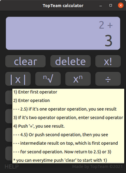
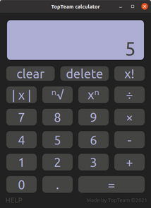

# TopTeam Calculator
 A simple implementation of arithmetic calculator for second IVS project
 with main purpose - focus on TEAM WORK.

Calculator can calculate simple operation like addition, subtraction, multiplication, division, absolute value, power and extraction of root, and their combination after setting result.

## Environment
The program is primarly built for **Ubuntu 20.0 - _64bit_**

### Technical details
The program was built with programming language *Python3*, and for *PyQt5* was used for GUI.
Its installation is simple due to *DEBIAN* package:

1. * double click and install,  *or*
    * open terminal in directory with installer and write in command line:
        * `apt install ./topteam-calc.deb`
2. Then all you need to do is open `TopTeamCalc` and enjoy our app 

## Authors
The members of **TopTeam**:
* *xnovak2x* .................. **David Novák**
* *xbubak01* .................. **Natália Bubáková**
* *xkozub06* .................. **Tadeáš Kozub**
* *xklime47* ................... **Alena Klimecká**

## Licence
The project is distributed under the [**GNU GPL v.3 licence**](https://www.gnu.org/licenses/gpl-3.0)